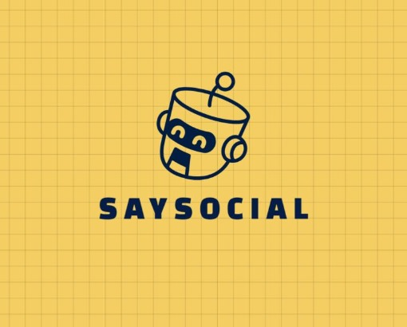
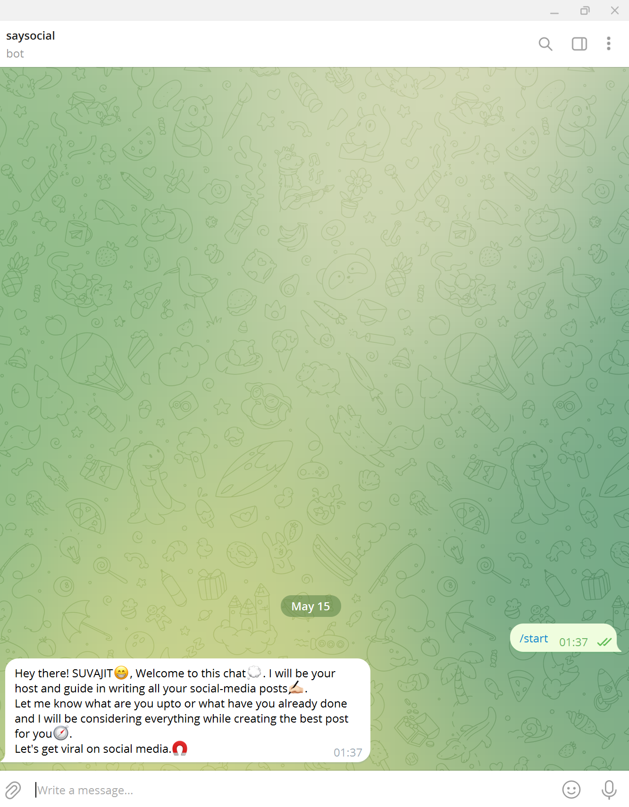
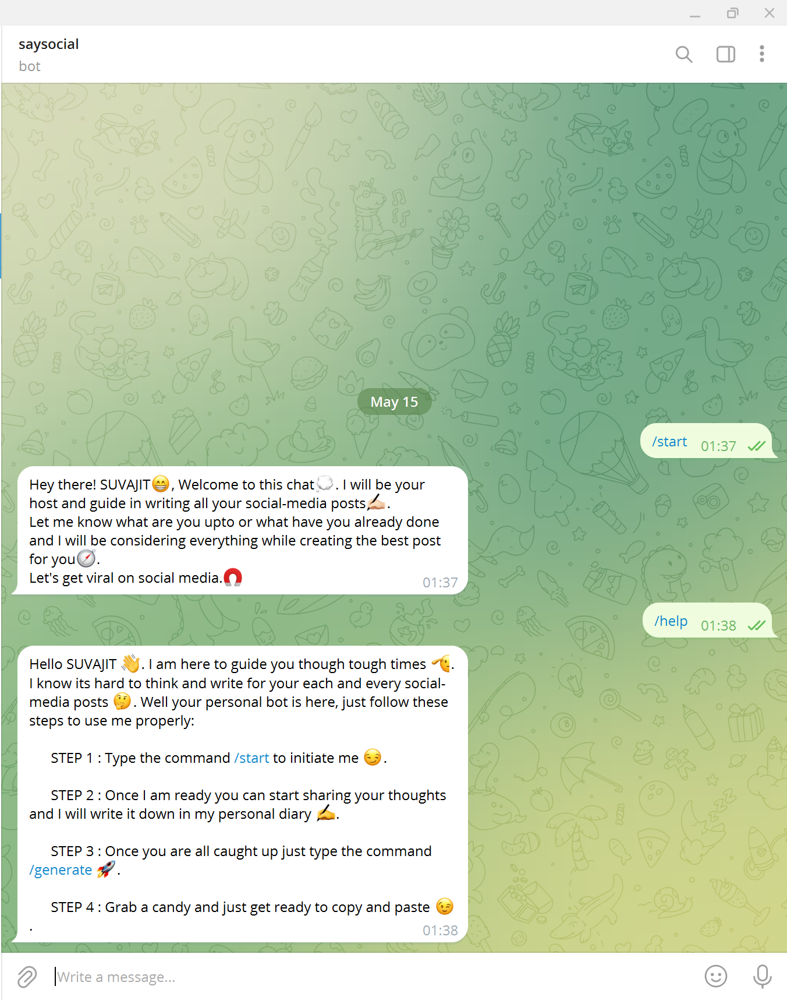
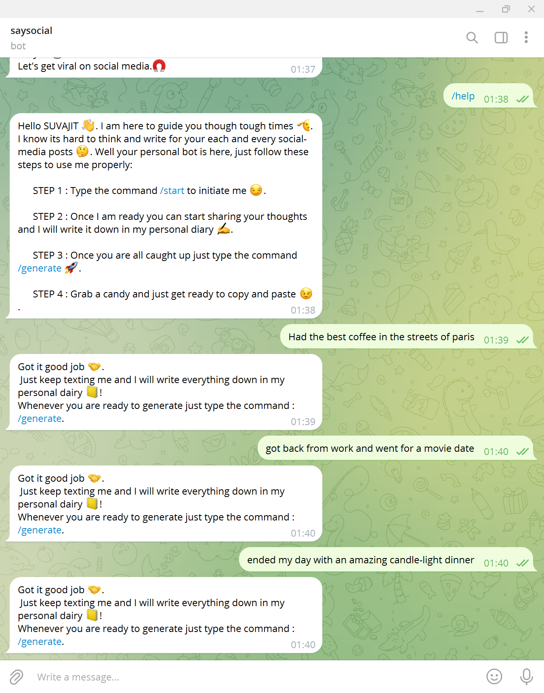
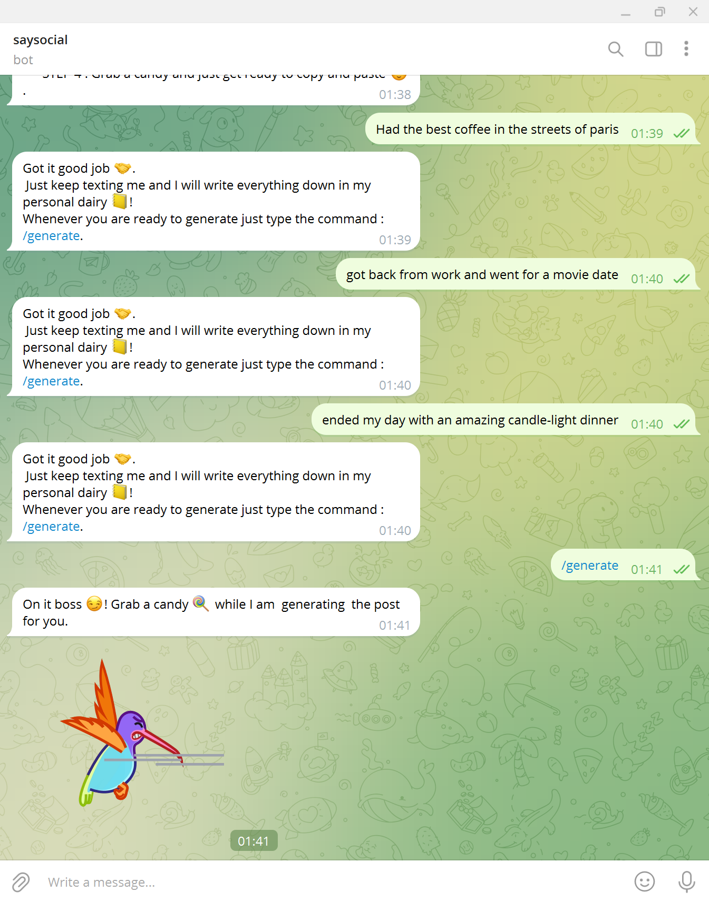
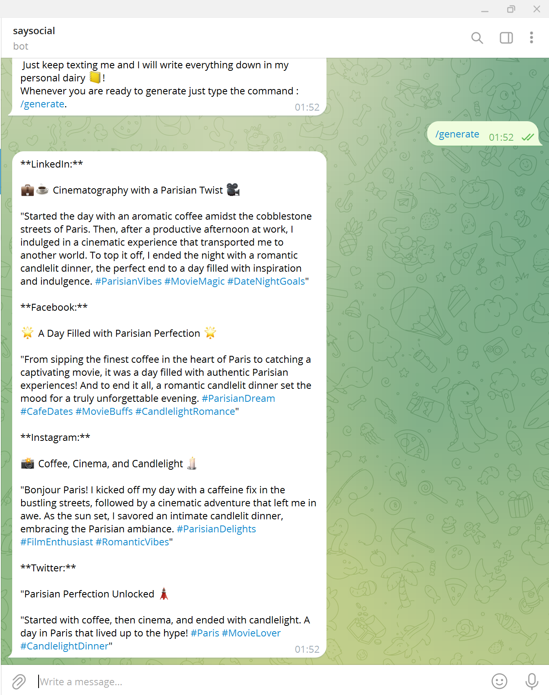

# saysocialbot - TELEGRAM BOT 
A single yet intriguing bot that will help you in generating your next social-media captions. It uses Google's GeminiAPI / OpenAi API in order to generate the captions and serve to the user.


## API REFERENCES

#### CASE 1 : Using ChatGPT API key 

```http
  https://openai.com/index/openai-api/
```

| Parameter | Type     | Description                |
| :-------- | :------- | :------------------------- |
| `OPENAI_API_KEY` | `string` | **Required**. Your API key |

#### CASE 2 : Using the Google's GeminiAPI key

```http
https://ai.google.dev/gemini-api/docs/api-key
```

| Parameter | Type     | Description                       |
| :-------- | :------- | :-------------------------------- |
| `GEMINI_API_KEY`      | `string` | **Required**. Your API key|

#### MongoDB Compass localhost connection link 
```http
mongodb://localhost:27017/{your-database-cluster-name}
```

#### Telegram bot token link 
```http
{Create your bot using the botfather in telegram application}
```


## BADGES


[](https://choosealicense.com/licenses/mit/)

[](https://opensource.org/licenses/)

[](http://www.gnu.org/licenses/agpl-3.0)


## RUN LOCALLY

To run this project run in your system locally

```bash
    cd <project structure>
    npm install 
```
### 

```bash
    npm run dev
```

## SCREENSHOTS







## AUTHOR

- [@SUVAJITKARMAKAR](https://www.github.com/SUVAJITKARMAKAR)

## TRY THIS BOT HERE 
- [saysocialbot](https://t.me/saysocialbot)

